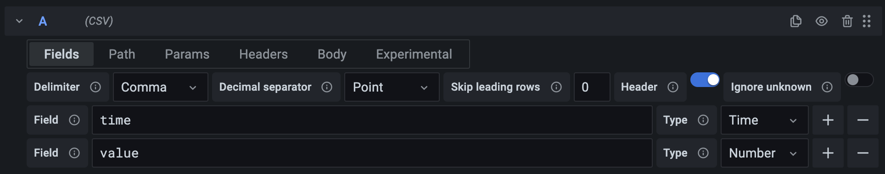
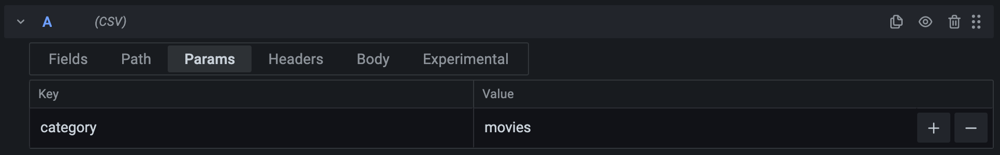

# Query data

You can query CSV data by using the data source's [query editor](#query-editor), or with [variables](#variables) or [annotations](#annotations).

## Query editor

The query editor for the CSV data source consists of a number of tabs.
Each tab configures a part of the query.

### Fields

Use the **Fields** tab to configure how to parse the data returned by the URL configured in the data source configuration.

- **Delimiter** defines how columns are separated in the file.
- **Decimal separator** defines the character used to separate the integer and fractional part of a number.
- **Skip leading rows** defines the number of rows at the start of the data to ignore.
  You can use this to skip comments, documentation, or other information before the data.
- **Header** defines whether the first row contains the names of each column.
- **Ignore unknown** toggles whether to display columns that aren't defined in the schema.
  You can use this to focus on a few specific columns.

By default, all columns in the CSV data are treated as text.
To parse a column into a specific type, such as Time or Number, you must define a _schema_.

- **Field** references a column in the CSV data. If no header is present, you can reference the columns by their order, such as "Field 1".
- **Type** defines the column's type.
  If the type is anything other than **String**, the data source tries to parse the data into the specified type.
  The data source ignores any values that can't be parsed.

### Path

The contents of this tab depends on whether the data source is set to HTTP or Local mode.
n both cases, the path is relative to the data source URL.

#### HTTP

The drop-down box to the left configures the **HTTP method** of the request sent to the URL, and can be set to **GET** and **POST**.

The text box appends a path to the URL in the data source configuration.
You can use this to dynamically change the request URL with [variables](https://grafana.com/docs/grafana/latest/dashboards/variables/).

For example, by setting the path to `/movies/${movie}/summary` you can query the summary for any movie without having to change the query itself.

#### Local

**Relative path** appends a relative path to the one in the data source configuration.
For example, you can use the same data source to load multiple files by setting the **Path** in the data source configuration to a directory, and then use the **Relative path** to load a file within that directory.

### Params

> **Note:** Only available in HTTP mode.
> Query parameters set by the administrator in the data source configuration have higher priority and override the parameters set by the query.

**Params** add parameters to the HTTP query string.
For example, the parameters in the screenshot are encoded as `?category=movies`.

Both the **Key** and **Value** fields support [variables](https://grafana.com/docs/grafana/latest/dashboards/variables/).

### Headers

> **Note:** Only available in HTTP mode.

**Headers** add parameters to HTTP headers.

Both the **Key** and **Value** fields support [variables](https://grafana.com/docs/grafana/latest/dashboards/variables/).

### Body

> **Note:** Only available in HTTP mode.
> Due to limitations in modern browsers, Grafana ignores the request body if the HTTP method is set to GET.

**Body** sets the text to send as a request body.

- **Syntax highlighting** sets the active syntax for the editor.
  This only affects visual formatting and doesn't change the request itself.

### Experimental

Experimental features are in development, and might be unstable and removed without notice.
Each feature has a link in its tooltip that takes you to the feature request on GitHub where you can share your feedback.

- **Enable regular expressions** lets you use regular expressions as field names in the schema.
  You can use this to set the type for any field that matches the expression.

## Variables

[Query variables](https://grafana.com/docs/grafana/latest/dashboards/variables/add-template-variables/#add-a-query-variable) extract data from a data source, which you can use to populate a dashboard variable.

To query the CSV data source with variables, refer to the Grafana documentation for [adding query variables](https://grafana.com/docs/grafana/latest/dashboards/variables/add-template-variables/#add-a-query-variable).
Select the CSV from the list of data sources.

## Annotations

[Annotations](https://grafana.com/docs/grafana/latest/dashboards/build-dashboards/annotate-visualizations/) extract data from a data source and use it to annotate a dashboard.

To use the CSV data source for annotations, follow the instructions on [Querying other data sources](https://grafana.com/docs/grafana/latest/dashboards/build-dashboards/annotate-visualizations/#querying-other-data-sources).
Select the CSV from the list of data sources.

Configure a query with _at least_ two fields:

- A **String** field for the annotation text
- A **Time** field for the annotation time

To add titles or tags to the annotations, add additional **Fields** with the appropriate types.
